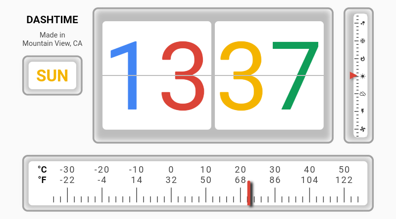
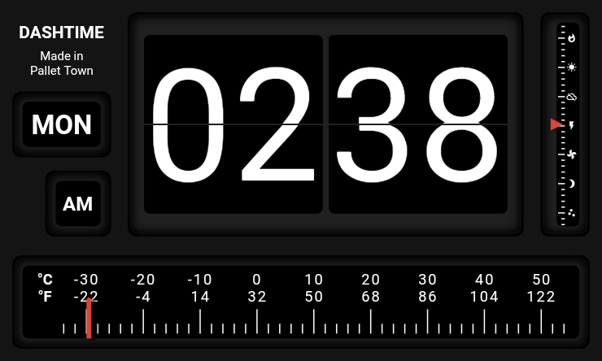
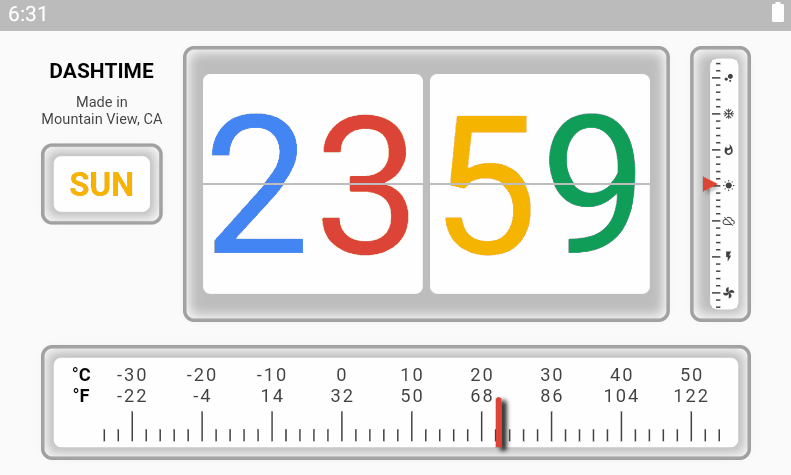

# Flutter Clock Submission

Submission for the Flutter Clock Challenge. See [flutter.dev/clock](https://flutter.dev/clock) for how to get started, submission requirements, contest rules, and FAQs.

The inspiration for this design came from vintage alarm clocks that most often came with a radio module equipped. Since the submission guideline explicitly stated that the clock design should not feature any audio functionality, I decided to use frequency selector to display information about the current temperature.

A list of features this clock design offers:
  * Flip card style design for displaying the current time (including animation)
  * Temperature indicator through a simple slider mechanism (°C and °F)
  * Animated spinner for showing the current weather condition through Material design icons
  * Weekday indicator
  * AM/PM indicator when using the 12-hour format
  * Location indicator (shown through the "Made in" flavor text)
  * Light and dark theme support

Further remarks:
  * Landscape mode is enforced by design
  * I removed the two pixels border in customizer.dart (as officially discussed in this [GitHub issue](https://github.com/flutter/flutter_clock/issues/35))

## Screenshots
 
Light theme



Dark theme



## Demo



## How to run

```
flutter channel stable
flutter upgrade
unzip flutter_clock_submission_dangpg.zip
cd vintage_flip_clock
flutter create .
flutter run
```

Tested using the following AVD:

```
Name: Lenovo_Smart_Clock_API_29
CPU/ABI: Google APIs Intel Atom (x86)
Path: C:\Users\dngph\.android\avd\Lenovo_Smart_Clock_API_29.avd
Target: google_apis [Google APIs] (API level 29)
Skin: 800x480
SD Card: 512 MB
fastboot.chosenSnapshotFile: 
runtime.network.speed: full
hw.accelerometer: no
hw.device.name: Lenovo Smart Clock
hw.lcd.width: 480
hw.initialOrientation: landscape
image.androidVersion.api: 29
tag.id: google_apis
hw.mainKeys: yes
hw.camera.front: emulated
avd.ini.displayname: Lenovo Smart Clock API 29
hw.gpu.mode: host
hw.ramSize: 1536
PlayStore.enabled: false
fastboot.forceColdBoot: no
hw.cpu.ncore: 4
hw.keyboard: yes
hw.sensors.proximity: no
hw.dPad: no
hw.lcd.height: 800
vm.heapSize: 48
skin.dynamic: yes
hw.device.manufacturer: User
hw.gps: no
skin.path.backup: _no_skin
hw.audioInput: yes
image.sysdir.1: system-images\android-29\google_apis\x86\
showDeviceFrame: no
hw.camera.back: virtualscene
AvdId: Lenovo_Smart_Clock_API_29
hw.lcd.density: 240
hw.arc: false
hw.device.hash2: MD5:f4bc765f84c91a7d9e9d9926d87229de
fastboot.forceChosenSnapshotBoot: no
fastboot.forceFastBoot: yes
hw.trackBall: no
hw.battery: yes
hw.sdCard: yes
tag.display: Google APIs
runtime.network.latency: none
disk.dataPartition.size: 800M
hw.sensors.orientation: no
avd.ini.encoding: UTF-8
hw.gpu.enabled: yes
```